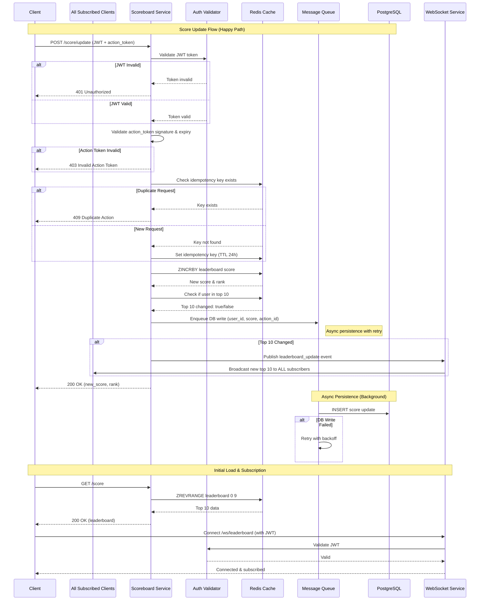

# Problem 6 — Live Scoreboard Module

## Overview

**A backend module responsible for managing a real-time leaderboard displaying the top 10 user scores. The service authenticates and validates user actions before updating scores, then broadcasts changes to all connected clients via WebSocket.**

---

## API Endpoints

| Method | Endpoint | Description |
|--------|----------|-------------|
| `POST` | `/score/update` | Update user score after completing an action |
| `GET` | `/score` | Retrieve the current top 10 leaderboard |
| `WS` | `/ws/leaderboard` | WebSocket connection for real-time updates |

### POST /score/update

**Request Headers:**
```
Authorization: Bearer <JWT_TOKEN>
X-Request-ID: <UUID> (optional, auto-generated if missing)
X-Idempotency-Key: <UUID> (required - prevents duplicate submissions)
```

**Request Body:**
```json
{
  "action_id": "string (unique identifier for the completed action)",
  "action_token": "string (server-signed token proving action completion)",
  "timestamp": "ISO 8601 timestamp"
}
```

**Response (200 OK):**
```json
{
  "success": true,
  "new_score": 1500,
  "rank": 3
}
```

**Error Responses:**
| Status | Code | Description |
|--------|------|-------------|
| 401 | `UNAUTHORIZED` | Invalid or expired JWT |
| 403 | `INVALID_ACTION_TOKEN` | Action token validation failed |
| 409 | `DUPLICATE_ACTION` | Idempotency key already processed |
| 429 | `RATE_LIMITED` | Too many requests |

### GET /score

**Response (200 OK):**
```json
{
  "leaderboard": [
    { "rank": 1, "user_id": "abc123", "username": "player1", "score": 2500 },
    { "rank": 2, "user_id": "def456", "username": "player2", "score": 2300 }
  ],
  "updated_at": "2026-05-17T00:30:00Z"
}
```

---

## Security & Anti-Cheat Measures

### Authentication
- **JWT Authentication**: All score update requests require a valid JWT token in the `Authorization` header
- **Token validation**: Tokens are validated server-side (signature, expiration, user claims)

### Action Validation
- **Action Token**: When a user completes an action, the game/frontend generates a server-signed `action_token` that proves the action was legitimately completed. The backend validates this token before accepting the score update.
- **Idempotency Key**: Each action submission must include a unique idempotency key to prevent duplicate score submissions for the same action.

### Rate Limiting
- **Per-user limit**: Maximum 10 score updates per minute per user
- **Global limit**: Circuit breaker for abnormal traffic patterns

### Audit Trail
- All score updates are logged with user ID, action ID, timestamp, and IP address for forensic analysis

---

## Real-Time Distribution

- **WebSocket** ([Socket.IO](https://socket.io/)) layer broadcasts leaderboard updates to all connected clients
- Clients subscribe to the `/ws/leaderboard` channel upon connection
- When the top 10 changes, the server emits a `leaderboard_update` event with the new snapshot

---

## Data Store

| Store | Purpose |
|-------|---------|
| **Redis** | Cache for top 10 leaderboard (low-latency reads), sorted set for ranking, idempotency key storage |
| **PostgreSQL** | Persistent storage for all user scores and action history |

### Redis Data Structures
- `leaderboard:top10` — Sorted set for real-time ranking
- `idempotency:{key}` — TTL-based keys to track processed actions (24h expiry)

---

## Logging, Monitoring & Auditing

- **Request tracing**: Unique `X-Request-ID` header attached to every request
- **Metrics to emit**:
  - Rate of authentication failures
  - Rate of invalid action tokens (potential cheating attempts)
  - Score update latency (p50, p95, p99)
  - WebSocket connection count
- **Alerts**: Trigger on spike in auth failures or invalid action tokens

---

## Sequence Diagram



---

## Improvement Suggestions

1. **Action Token Generation**: Consider using HMAC-signed tokens with expiry (e.g., 30 seconds) to ensure actions are submitted promptly after completion.

2. **Leaderboard Pagination**: For future scalability, consider adding `GET /score?offset=0&limit=10` to support viewing beyond top 10.

3. **Score Delta vs Absolute**: The API could accept score increments (`+10`) rather than absolute values to prevent race conditions.

4. **Replay Protection**: Store processed `action_id` values to prevent replay attacks even if idempotency keys expire.

5. **WebSocket Authentication**: Require JWT validation on WebSocket connection handshake, not just REST endpoints.

6. **Graceful Degradation**: If Redis is unavailable, fall back to PostgreSQL for reads (with higher latency).
