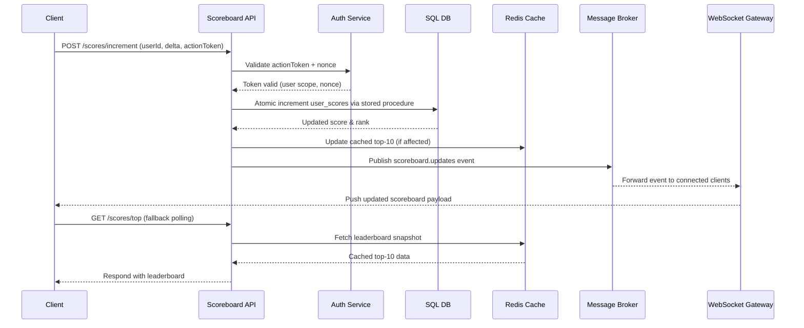

# Problem 6 — Live Scoreboard Module

## Overview

**The module responsible for ingesting live score of the top 10 users. Respective score point datas will be updated by users, the service needs to authenticate their action. The goal is to show the top 10 leaderboard in real-time.**

## API routes

<table class="tg"><thead>
  <tr>
    <th class="tg-0pky"> POST /score/update </th>
    <th class="tg-0pky"> Update the score after user action completed </th>
  </tr></thead>
<tbody>
  <tr>
    <td class="tg-0pky"> GET /score </td>
    <td class="tg-0pky"> Get the top 10 leaderboard data </td>
  </tr>
</tbody>
</table>

## Authorization

- **All score update APIs require JWT authentication**
- **Tokens must be validated server-side**

## Real Time distribution

- **[Web socket](https://socket.io/) layer used for update message publish via bus server to connected client.**

## Data Store

<table class="tg"><thead>
  <tr>
    <th class="tg-0pky">Redis</th>
    <th class="tg-0pky">Redis provides low-latency real-time operations</th>
  </tr></thead>
<tbody>
  <tr>
    <td class="tg-0pky">DB store</td>
    <td class="tg-0pky">The database is used for persistence.</td>
  </tr>
</tbody>
</table>

## Loggin, monitoring and auditing
- The module will automatically add unique ID to every request as header for tracing
- need to emit metrics like rate of authentication faliures etc.

## Sequence Diagram

